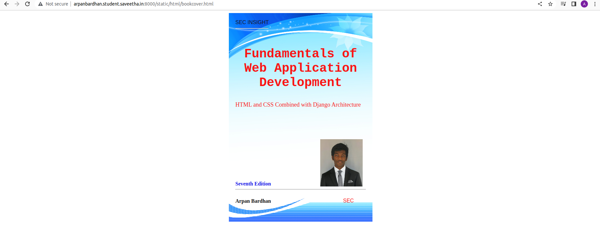
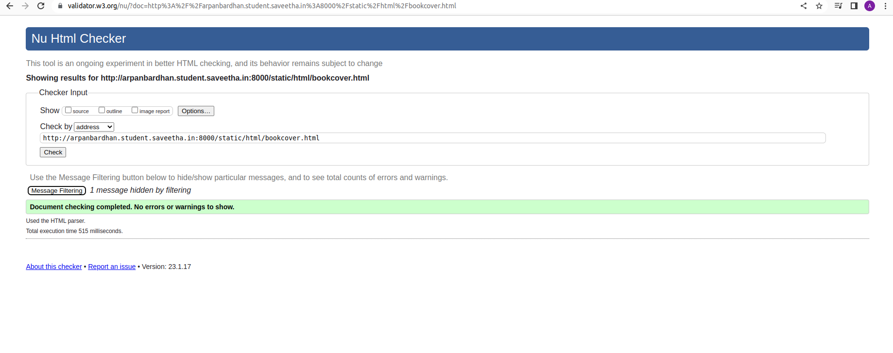

# cover-page-design
## AIM:
To develop a website to display the cover page design of a book

## Design Steps:

### Step 1:
Clone repository from Github.
Create your own template and add your image
Create a html file and write your code
### Step 2:
Run the server and check your result
## Code:
Include your HTML code here

bookcover.html

<!DOCTYPE html>
<html lang="en">
    <head>
         <meta name="viewport" 
         content="width=device-width, initial-scale=1.0">
         
        <title>Book Cover Page</title>
    </head>
    <body>
        

            

                SEC INSIGHT
            

            

                

            

            

                <h1>Fundamentals of Web Application Development</h1>

            

                HTML and CSS Combined with Django Architecture
            

            

                
            

            

                

            

            

               
<b>Arpan Bardhan</b>

            

            

                SEC
            

            

                <b>Seventh Edition</b>
            

        

    </body>
</html>

## Output:
Include your output screenshot here

## Result:
Therefore the program for creating bookcover is executed successfully.
